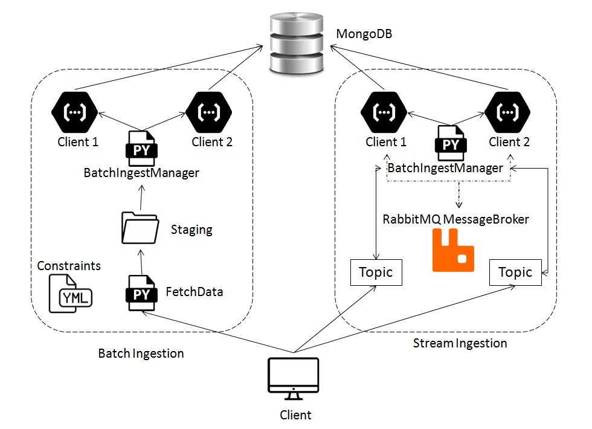

# Assignment 2 - Report


### Big Data Platforms - CS-E4640 

---

#### Design



* Fig 1: Ingestion Architecture

This design has two ingestion methods:

* __Batch Ingestion__
* __Stream Ingestion__

Both these methods are independent of each other. If the same Customer is using both methods to upload data, the data goes into the same database (mysimbdp-coredms) but follows different internal procedures.

### Part 1 

##### 1. Define a set of constraints for files which should (or should not) be ingested and for the customer service profile w.r.t. ingestion constraints (e.g., number of files and data sizes).

There are two customers cus1 and cus2. cus1 can only upload csv files with max filesize restricted to 1MB, cus2 can only upload json files with max filesize restricted to 2MB. These constraints on customers have been defined in the `constraints.yaml` file.

##### 2. Each customer will put files to be ingested into a directory, client-input-directory.Implement a component mysimbdp-fetchdata that automatically detect which files should be ingested based on customer profiles and only move the files from client-input-directory inside mysimbdp. (1 point)

The Watchdog module for Python has been implemented to monitor changes in the filesystem. This module has been imported in the `fetchdata.py` that uses an Observer to detect addition or deletion of files in the `client-input-directory`.

##### 3. Each customer provides a simple program, clientbatchingestapp, which will take the customer's files as input and ingest the files into the final sink mysimbdp-coredms. Design and develop a component mysimbdp-batchingestmanager that invokes customer's clientbatchingestapp to perform the ingestion when files are moved into mysimbdp. mysimbdp imposes the model that clientbatchingestapp (and the customer) has to follow. (1 point)

The Subprocess module has been imported within `batchingestmanager.py` that creates a new process to invoke `clientbatchingestapp.py` and also collects database statistics updating it to the reports table.

##### 4. Develop test programs (clientbatchingestapp), test data, and test profiles for customers. Show the performance of ingestion tests, including failures and exceptions, for at least 2 different customers in your test environment. (1 point) & 5. Implement and provide logging features for capturing successful/failed ingestion as well as metrics about ingestion time, data size, etc., for files which have been ingested into mysimbdp. The log should be outputed in a separate file or database for analytics of ingestion. (1 point)

`clientbatchingestapp.py` has a well defined report schema that collects values like ingestion size, time taken, rows, collection size and average object size while the customer data is getting uploaded via FTP and stores into `clientbatchingestapp.log` file as long as no constraints are not violated.

### Part 2 

##### 1. For near-realtime ingestion, you introduce a simple message structure ingestmessagestructure that all consumers have to use. Design and implement ingestmessagestructure for your customers; explain your design. (1 point)

cus1 uses csv format and the data is heavier as compared to cus2 uses json with less dense data so message structures for both customers are different.


##### 2. Customers will put their data into messages following ingestmessagestructure to send the data to a message broker, mysimbdp-databroker (provisioned by mysimbdp) and customers will write a program, clientstreamingestapp, which read data from the broker and ingest data into mysimbdp. Provide a component mysimbdp-streamingestmanager, which invokes on-demand clientstreamingestapp (e.g., start, stop). mysimbdp imposes the model that clientstreamingestapp has to follow. (1 point)

RabbitMQ is used as a message broker to send available topics to the customer that are created dynamically by `streamingestmanager.py` with the help of threading, subprocess and pika modules. It can create new topics and publish to the client simultaneously detecting the load whether it is low or high and kill the topics accordingly.

##### 3. Develop test programs (clientstreamingestapp), test data, and test profiles for customers. Show the performance of ingestion tests, including failures and exceptions, for at least 2 different customers in your test environment. (1 point)

once the topics are created and published by `streamingestmanager.py`, the client has to request the appropriate available topic via command line argument and then `streamingestmanager.py` invokes `clientstreamingestapp.py` which in turn connects to the database, performs the data entry and saves all the operational information in the `clientstreamingestapp.log` file.

##### 4. clientstreamingestapp decides to report the its processing rate, including average ingestion time, total ingestion data size, and number of messages to mysimbdpstreamingestmanager within a pre-defined period of time. Design the report format and the communication mechanism for reporting. (1 point)

`clientstreamingestapp.py` has the following schema definition for a report : -

```

        stats_coll = db.command("collstats", table_name)
        report = {
                    'clientID':client,
                    'time':self.end-self.start,
                    'input_time':self.data["input_time"],
                    'size_coll':stats_coll['size'],
                    'count_coll':stats_coll['count'],
                    'avgObjSize_coll':stats_coll['avgObjSize']
                    } 
```
This saves the necessary information into the reports table.

##### 5. Implement the feature to receive the report from clientstreamingestapp. Based on the report from clientstreamingestapp, when the performance is below a threshold, e.g., average ingestion time is too low, or too many messages have to be processed, mysimbdpstreamingestmanager decides to create more instances of clientstreamingestapp. Define a model for specifying constraints for creating/removing instances for each customer. (1 point).

Threading, Process and Pika modules have been imported into `streamingestmanager.py` so that new topics can be created and published. Also it is capable of killing a topic when the load is low and create more topics according to customer demand.

### Part 3

##### 1. Produce an integrated architecture for both batch and near-realtime ingestion features in this assignment and explain the architecture. (1 point)

The above design is capable of ingesting data from the customer into the database in both the ingestion techniques. Irrespective of the choice of Ingestion method provided by the customer, the data is uploaded into the same database but through two different routes.

##### 2. Assume that if a file for batch ingestion is too big to ingest using the batch ingestion implementation in Part 1, design your solution to solve this problem by reusing your batch or near-realtime components in Parts 1 or 2. (1 point)

In part 1 the `fetchdata.py` is capable of performing Microbatching when the data is too large which means it violates the filesize constraint. It is implemented as:

```
        if os.path.getsize(f_name) > constraints[c_name]["filesize"]:
        print("file size too big for the client" + f_name +""+     str(os.path.getsize(f_name)),         
        file=open("fetchData.log", "a"))
        self.microbatch(f_name, constraints[c_name]["filesize"], c_name)
        os.remove(f_name)
```

In part 2 the `streamingestmanager.py` is capable of detecting increase in load and dynamically create new topics and assign to the requesting client. It is implemented as:

```       
                report = json.loads(body.decode())
                if report["time"] > 10:
                clientName = report["clientID"]
                topicName = clientName+"_"+str(len(topics_avl[clientName]))
                print("Start new topic for", report["clientID"])
                a = subprocess.Popen(['python', 'clientstreamingestapp.py', topicName])
                topics_avl[clientName].append(topicName)
                jobs[clientName].append(a)
```

##### 3. Regardless of programming languages used, explain why you as a platform provider should not see the code of the customer, like clientbatchingestapp and clientstreamingestapp. In which use cases, you can assume that you know the code? (1 point)

There can be no compromise with privacy and integrity of user as it against the laws of every country therefore it does not matter what programming language the customer is using, the platform provider is not supposed violate the customer's privacy in order to maintain strong work ethics and long lasting business relations.

##### 4. If you want to detect the quality of data and allow ingestion only for data with a pre-defined quality of data condition, how you, as a platform provider, and your customers can work together? (1 point)

In order to achieve this the Client and Service provider need to have an agreement on a specific data structure or in other words, the Database service provider needs to know the schema of the data that the customer is trying to enter into the database. This functionality can be achieved by pre-defining the schema into the `clientstreamingestapp.py` and `clientbatchingestapp.py` files and also add an extra layer of validation and constraints at the database level so that the database does not allow any other form of data to be entered that differs from the pre-defined set of constraints.

##### 5. If a consumer has multiple clientbatchingestapp and clientstreamingestapp, each is suitable for a type of messages or files, how would you extend your design and implementation in Parts 1 & 2 (only explain the concept/design) to support this requirement. (1 point)

The datasets that are uploaded into the database are directly mapped to the clientname such as
```             
        a = subprocess.Popen(["python", "clientbatchingestapp.py", c_name])
```
as shown in the `batchingestmanager.py` file. If we add another parameter, say 
```             
        a = subprocess.Popen(["python", "clientbatchingestapp.py", category, c_name])
```
then it serves as an extra identifier for the client that is requesting the service and can accomodate more such clients that can be differentiated from each other according to the category of datasets. This can be implemented in the same way in `clientstreamingestapp.py` file.

# Bonus points
### If you can design and implement the dynamic management of instances for Part 2/Question 5, you get 5 points

As said in part 2.5 and 3.2 (second part), `clientstreamingestapp.py` is capable of creating new topics for requesting clients whenever it automatically detects an increase in load.

### If you can develop the solution that automatically switch from batch to microbatching based on a set of constraints (e.g., file size, time, bandwidth) you get 5 points

Whenever there is an increase in filesize such that it violates the constraint, `fetchdata.py` automatically initiates Microbatching and breaks them down into chunks and then stores them into the database.


